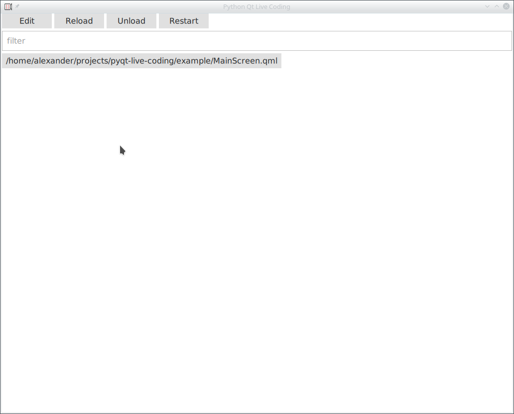

# Live Coding Environment for Python, Qt and QML
[](https://badge.fury.io/py/python-qt-live-coding)
[](https://travis-ci.org/machinekoder/python-qt-live-coding)
[](https://github.com/machinekoderpython-qt-live-coding/blob/master/LICENSE)
[](https://github.com/ambv/black)


This project provides a live coding environment for Python and Qt. It supports both [PyQt](https://riverbankcomputing.com/software/pyqt/intro) and [Qt for Python (PySide2)](http://wiki.qt.io/Qt_for_Python)
via the [python_qt_binding](https://pypi.org/project/python_qt_binding/).

## Install

To install the live coding environment run:

```bash
python setup.py install
```

or install it via pip

```bash
pip install python-qt-live-coding
```

You also need to install PyQt or PySide2 for this application to work. The quickest way to
achieve this is to use pip.

```bash
pip install PyQt5
```

or

```bash
pip install pyside2
```

## Use

The live coding environment comes with a live runner which enables your to live
code Qt GUIs quickly.

Run following to test drive the example:

```bash
python_qt_live_coding examples
```

Your will instantly see the example project in the live runner.



Now you can either select the `MainScreen.qml` file or type `MainScreen` in the filter.

When you type, the file will be automatically selected.

When loaded you will see following.


This is the example GUI inside the live runner.

Now press the `Edit` button. Your favorite text editor should open promptly.

Edit the code inside the editor und you will see the GUI updates instantly when you save the document.

### Integrate in your application

Alternatively, you can integrate live coding into your Python Qt application.

This especially useful if you want to customize the live coding GUI for your needs.

For this purpose you need to do following things:

1. Integrate the `start_live_coding` function into your `main.py`.
2. Add a command line argument for live coding.
3. Optionally, add a custom `live.qml`.

To learn more about how this works please take a look the [*integrated* example](./examples/integrated).

## Python QML module support

The live coding environment has built in support for Python QML modules.

The idea is to place QML and Python code in the same directory, similar to how you would create a Qt/C++ application.
Additionally, with Python we have the advantage of being able to discover modules automatically.

For this purpose add `register_qml_types` function to the `__init__.py` of your Python QML module.
See the example in [examples/standalone/module/\_\_init__.py](./examples/standalone/module/__init__.py).

However, so far automatic reloading of Python code is not support.
When you work on a Python module please use the `Restart` button which restarts the live coding application instead.

## Forcing PyQt or Python for Qt (PySide2) usage

In some cases you might want to force which Python Qt binding `python_qt_live_coding` is using.
This can be done by passing the optional `--binding` argument via the command line.


```bash
python_qt_live_coding -b pyside .
```

## PyCharm Support

For this application to work with PyCharm and other IntelliJ IDEs please disable the "safe write" feature.
The feature writes a temporary file before saving any file, which can confuse the file change watcher.
